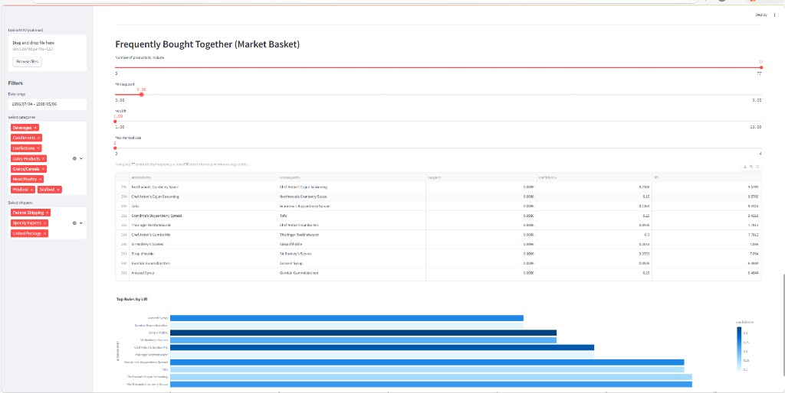
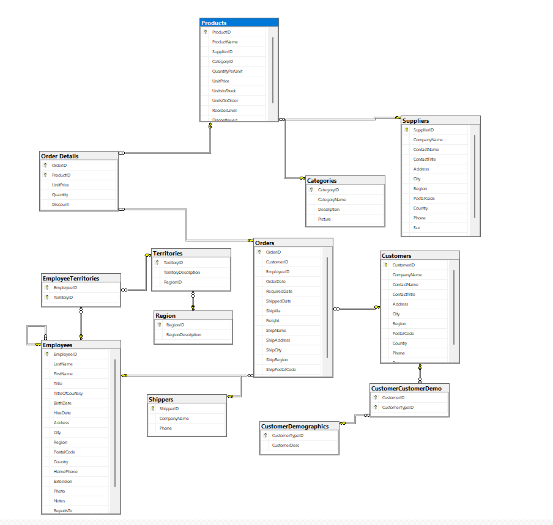
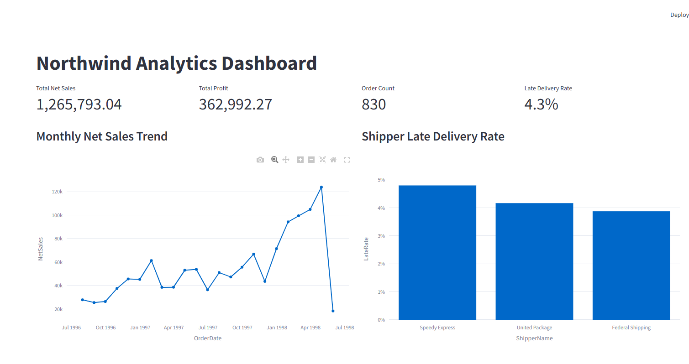
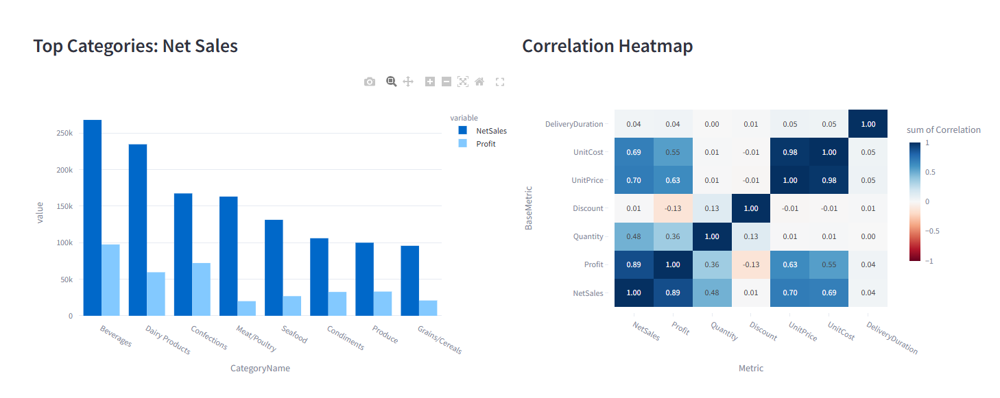
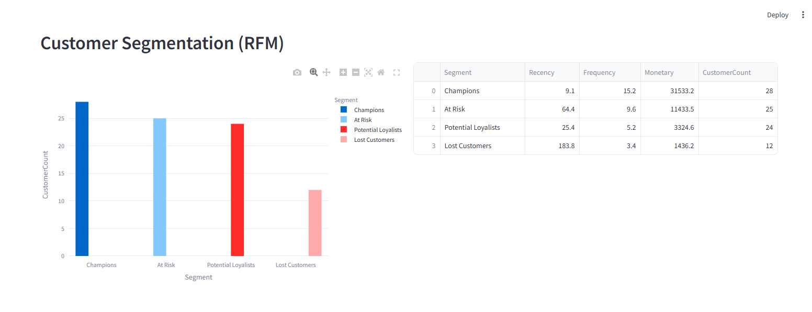
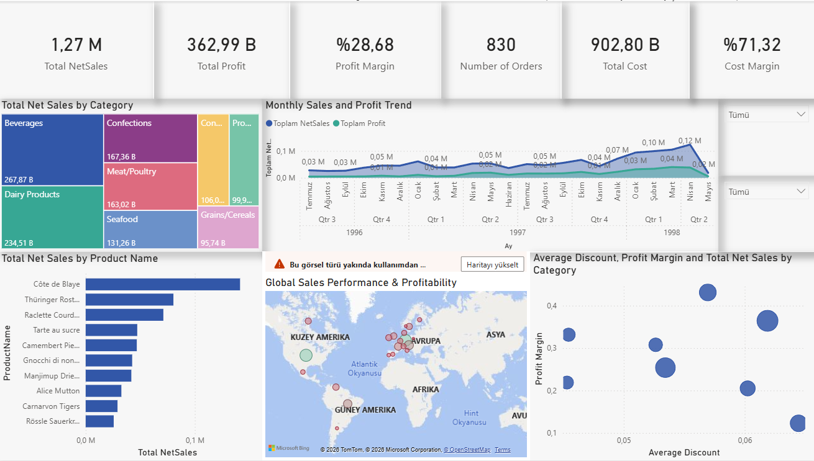

# Northwind Analytics Dashboard

Interactive analytics dashboard built with Streamlit on top of the Northwind database.  
The application combines sales, logistics, inventory, and customer behavior analysis in a single interface.

## Screenshots

### Streamlit Dashboard



Additional dashboard views:






### Power BI Report




## What This Project Includes

- Executive KPIs (net sales, profit, order count, late delivery rate)
- Time and category based performance analysis
- Logistics and late shipment monitoring by shipper
- Inventory health and critical stock tracking
- Customer segmentation with RFM + KMeans
- Market basket analysis with Apriori association rules
- Optional Power BI report integration section

## Tech Stack

- Python
- Streamlit
- Pandas / NumPy
- Plotly
- scikit-learn
- mlxtend
- pyodbc (SQL Server connection)

## Required Database Objects

The app expects these SQL views in the `Northwind` database:

- `vw_MasterSales`
- `vw_LogisticsAndShipping`
- `vw_InventoryPerformance`
- `vw_CustomerAnalytics`

## Project Structure

- `app.py` - Streamlit application
- `requirements.txt` - Python dependencies
- `.streamlit/secrets.toml` - local secrets (ignored by git)
- `.streamlit/secrets.example.toml` - example config template
- `exploratory_data_analysis.ipynb` - exploratory notebook

## Setup

1. Install dependencies:

```bash
pip install -r requirements.txt
```

2. Create local secrets file:

```bash
mkdir .streamlit
```

Create `.streamlit/secrets.toml` and add:

```toml
SQL_SERVER = "localhost\\SQLEXPRESS"
SQL_DATABASE = "Northwind"
POWER_BI_SHARE_URL = "https://app.powerbi.com/links/your-share-link"
POWER_BI_EMBED_URL = ""
```

Notes:
- `POWER_BI_SHARE_URL` is optional. It is used for opening the report in a new tab.
- `POWER_BI_EMBED_URL` is optional. If provided, it is embedded directly in the app.
- You can also use environment variables instead of `secrets.toml`.

## Run

```bash
streamlit run app.py
```

Open the local URL shown in terminal (usually `http://localhost:8501`).

## Security Notes

- `.streamlit/secrets.toml` is ignored via `.gitignore` and should not be committed.
- Keep credentials, tokens, and private URLs in local secrets or environment variables.
- If a secret was committed previously, rotate it and clean git history if needed.

## Troubleshooting

- **`StreamlitSecretNotFoundError`**  
  Create `.streamlit/secrets.toml` and set `SQL_SERVER` / `SQL_DATABASE`.

- **Power BI iframe shows "refused to connect"**  
  Share links (`app.powerbi.com/links/...`) may not support iframe embedding.  
  Use a proper embed URL, or open via the new-tab button in the app.

- **SQL connection error**  
  Check SQL Server instance name, database name, and that required views exist.

## License

This project is licensed under the MIT License.

