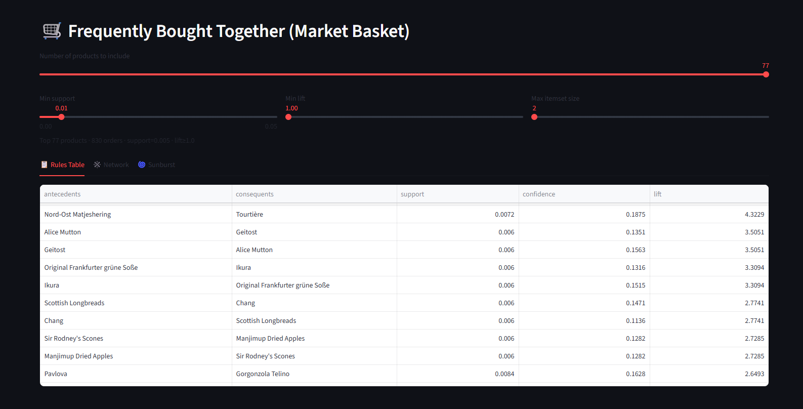
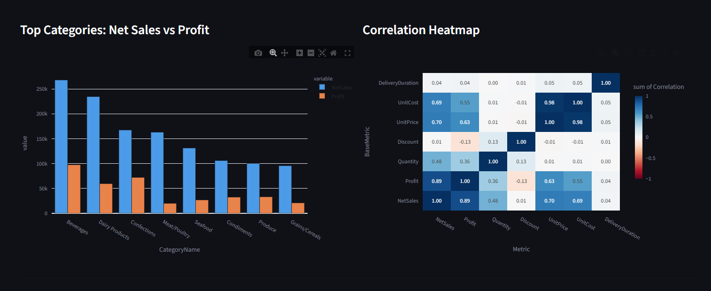
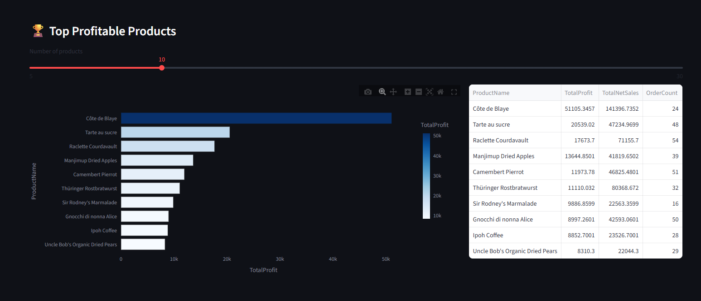
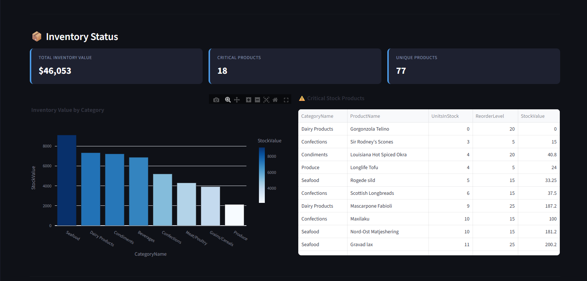
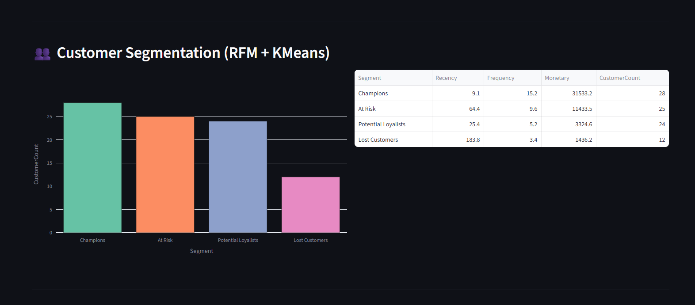

# 📊 Northwind Analytics Dashboard

[](https://your-app-name.streamlit.app)


End-to-end retail analytics application built on the classic **Northwind** database. Combines SQL data modeling, machine learning, and interactive visualization in a single deployable Streamlit app.

> 🔗 **[Live Demo →](https://your-app-name.streamlit.app)**

---

## 📸 Screenshots



<details>
<summary>More screenshots</summary>






</details>

---

## 🎯 What This Project Demonstrates

This project goes beyond basic charting — it covers the full analytics workflow:

| Layer | Skills Demonstrated |
|---|---|
| **Data Engineering** | SQL views, multi-table joins, dual data source (SQL Server / CSV fallback) |
| **Analytics** | RFM scoring, KMeans clustering, Apriori association rules |
| **Visualization** | Plotly (line, bar, heatmap, network graph, sunburst), dark-mode theming |
| **Engineering** | Streamlit caching, memory-safe Apriori, secrets management, cloud deploy |

---

## ✨ Features

- **Executive KPIs** — Net sales, profit, order count, late delivery rate
- **Sales Analysis** — Monthly trend, category breakdown, profit vs. revenue comparison
- **Logistics Monitoring** — Late delivery rates by shipper
- **Inventory Health** — Stock value by category, critical stock alerts
- **Customer Segmentation** — RFM + KMeans (4 clusters: Champions, At Risk, Potential Loyalists, Lost)
- **Market Basket Analysis** — Apriori association rules with network graph and sunburst visualizations
- **Power BI Integration** — Optional embedded report section

---

## 🛠 Tech Stack

```
Python · Streamlit · Pandas · NumPy · Plotly
scikit-learn · mlxtend · NetworkX · pyodbc
SQL Server (local) / CSV (cloud fallback)
```

---

## 📂 Project Structure

```
├── app.py                          # Main Streamlit application
├── requirements.txt                # Python dependencies
├── northwind_data.csv              # CSV dataset (cloud deploy)
├── sql/
│   ├── 01_vw_MasterSales.sql
│   ├── 02_vw_LogisticsAndShipping.sql
│   ├── 03_vw_InventoryPerformance.sql
│   └── 04_vw_CustomerAnalytics.sql
├── assets/                         # Screenshots and images
├── exploratory_data_analysis.ipynb # EDA notebook
└── .streamlit/
    └── secrets.example.toml        # Config template
```

---

## 🚀 Getting Started

### Option A — CSV mode (no database needed)

```bash
git clone https://github.com/YusufBob41/retail-analytics-dashboard
cd retail-analytics-dashboard
pip install -r requirements.txt
streamlit run app.py
```

The app auto-detects `northwind_data.csv` and runs without any database setup.

### Option B — SQL Server mode

1. Run the view scripts in order:
```sql
-- In SQL Server Management Studio, run these against your Northwind database:
sql/01_vw_MasterSales.sql
sql/02_vw_LogisticsAndShipping.sql
sql/03_vw_InventoryPerformance.sql
sql/04_vw_CustomerAnalytics.sql
```

2. Create `.streamlit/secrets.toml`:
```toml
SQL_SERVER   = "localhost\\SQLEXPRESS"
SQL_DATABASE = "Northwind"
```

3. Run the app:
```bash
streamlit run app.py
```

---

## 💡 Key Business Insights

**Financial Performance**
- Beverages is the top profit driver; Confections leads on margin efficiency
- Meat/Poultry has the weakest margin due to high supply costs
- Aggressive discounting on low-margin products can push net profit negative

**Logistics**
- Federal Shipping shows the most consistent on-time delivery performance
- Several product lines carry stockout risk and are below reorder level

**Customer Segmentation (RFM)**
- Champions: high recency, frequency, and monetary value → priority retention target
- At-Risk: previously high-value, now inactive → win-back campaign candidates
- Lost Customers: low across all RFM dimensions → low ROI to re-engage

**Market Basket**
- High-lift product pairs identified for bundling and cross-sell recommendations
- Findings can directly inform shelf placement and promotional strategy

---

## 📄 License

MIT © [Yusuf](https://github.com/YusufBob41)
